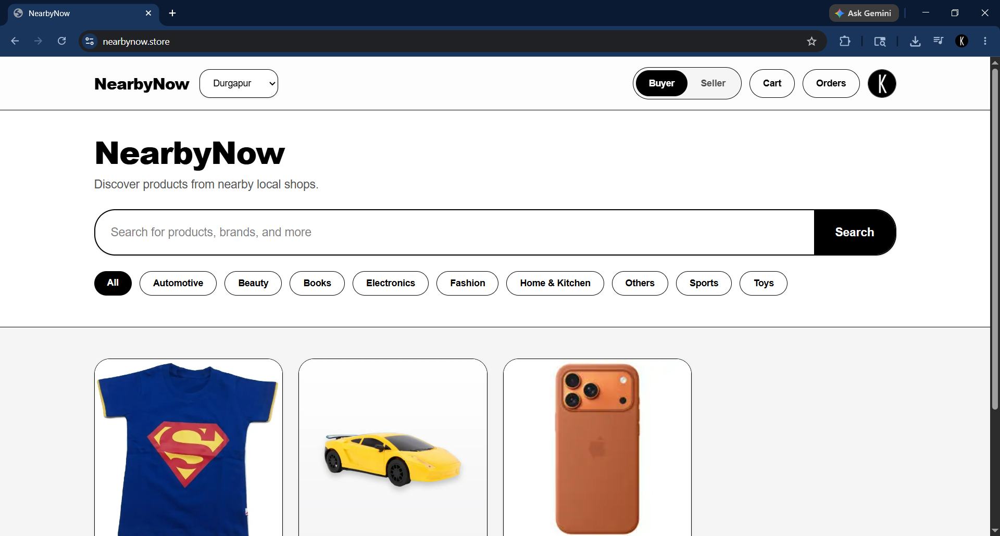
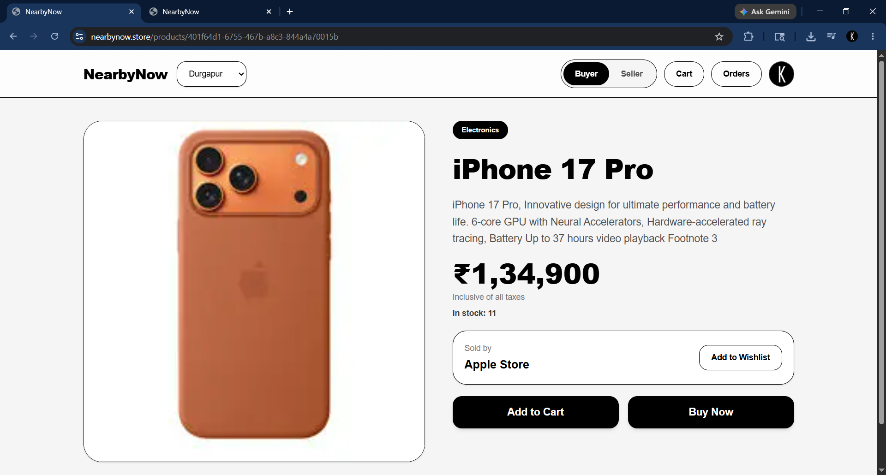
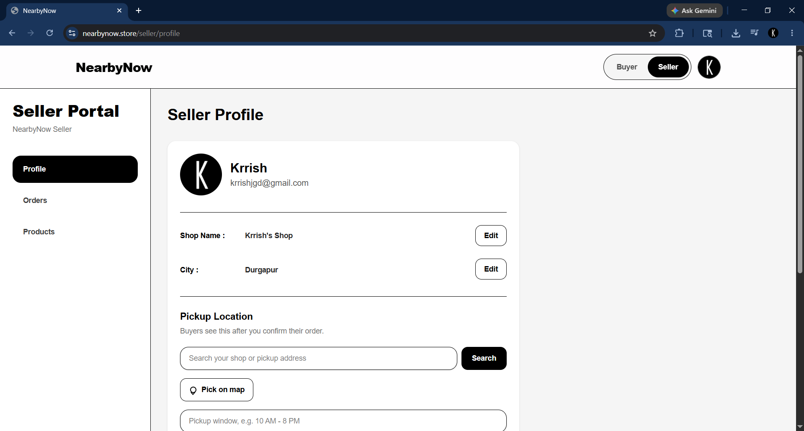
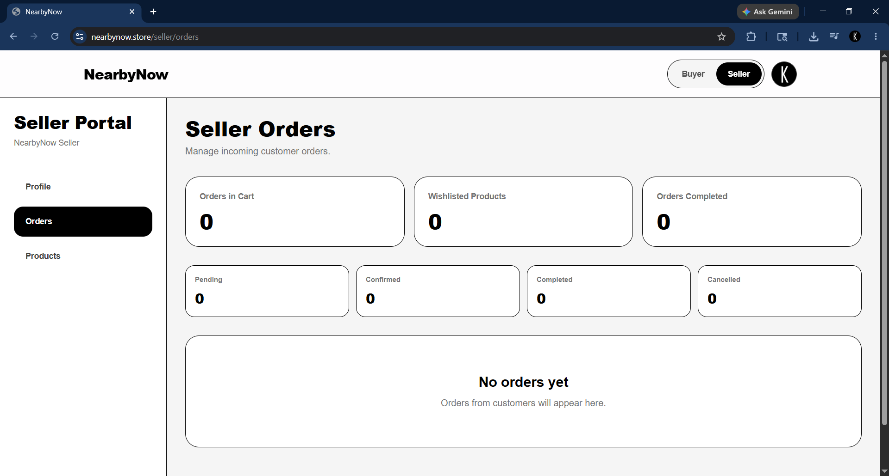
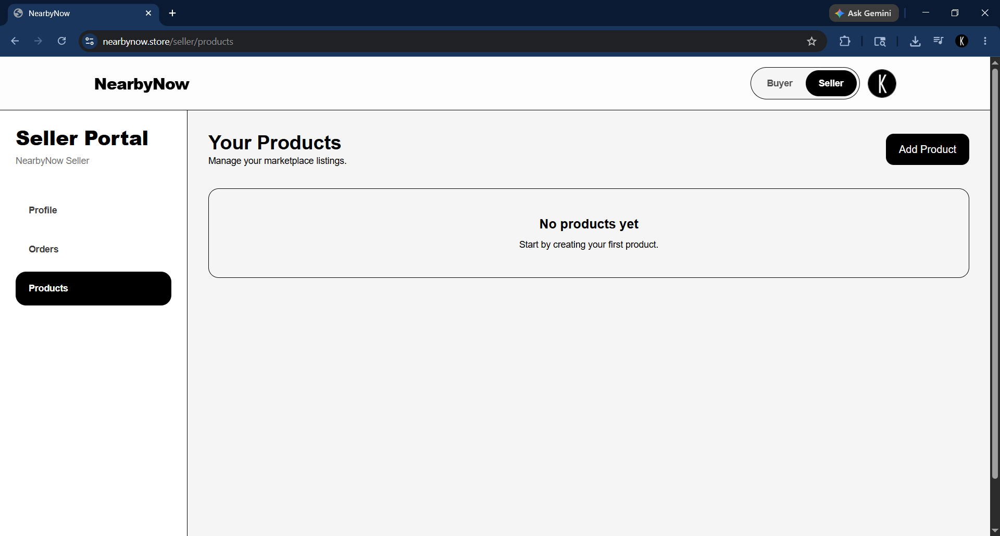

# NearbyNow

NearbyNow is a local marketplace app for discovering and buying products from nearby shops. The MVP is focused on Durgapur and is built around a simple local pickup flow: buyers browse products, place orders through the website, sellers confirm the order, and buyers pick up from the shop.

## Live Demo

https://www.nearbynow.store

## Repository

https://github.com/krrish-2006/nearbynow

## Screenshots

### Buyer Home Page



### Product Details Page



### Seller Profile Page



### Seller Orders Dashboard



### Seller Products Dashboard



## Tech Stack

- Next.js App Router
- React
- TypeScript
- Tailwind CSS
- Supabase Auth
- Supabase PostgreSQL
- Supabase Row Level Security
- Supabase Storage
- Server Actions
- Zod
- React Hook Form
- Native Node tests
- Playwright smoke tests
- Vercel deployment

## Current Features

### Buyer

- Browse nearby marketplace products
- Search and category filtering
- AI-assisted product search support
- Product detail pages
- Product wishlist/favorites
- Cart and direct Buy Now flows
- COD order placement
- Buyer order history
- Buyer-visible status updates from sellers
- Pickup location details after seller confirmation

### Seller

- Seller mode and protected seller portal
- Seller profile with shop name and city management
- OpenStreetMap/Leaflet pickup-location picker
- Device-location button for pickup pin selection
- Product create, edit, delete, and image upload
- Up to five product images
- Product image moderation support
- AI image enhancement credit system
- Razorpay-based AI credit purchase flow
- Seller order dashboard
- Seller status controls: Pending, Confirmed, Completed, Cancelled
- Seller metrics for cart quantity, wishlisted products, and completed orders

### Marketplace And Fulfillment

- Atomic checkout RPCs for order creation and stock decrement
- Multi-shop cart support through item-level fulfillment ownership
- Seller-scoped order visibility through RLS and RPCs
- Protected pickup locations separate from public shop data
- Parent order status derived from item statuses
- COD payment status derived from order status

## My Role

I designed and developed the full-stack MVP of NearbyNow.

My work includes:

- Building the buyer marketplace interface
- Building the seller portal
- Designing product, cart, order, wishlist, and pickup flows
- Implementing Supabase Auth, PostgreSQL, RLS, and Storage integration
- Writing Server Actions, repositories, services, and typed feature models
- Building validated product forms with Zod and React Hook Form
- Adding AI-assisted search and AI image-enhancement credit architecture
- Adding Razorpay payment integration for seller AI credits
- Deploying and iterating on Vercel

## What I Learned

- How to structure a real Next.js App Router project
- How to design buyer and seller workflows
- How to use Supabase Auth, PostgreSQL, Storage, RLS, and RPCs together
- How to keep critical checkout behavior atomic in the database
- How to build safer Server Actions and repository layers
- How to think about marketplace trust, stock, pickup, and seller operations
- How to ship, test, deploy, and improve a real product over time

## Known Limitations

NearbyNow is still an MVP and is actively being improved.

Current limitations:

- Razorpay live payments require completed live-mode setup/KYC before real money can be collected.
- AI image enhancement quality depends on the currently connected provider and can improve with a stronger GPU image pipeline later.
- Seller analytics are still basic.
- Browser E2E coverage is still mostly smoke-level and should be expanded for authenticated checkout/status flows.
- The marketplace is currently focused on the Durgapur MVP use case.
- Product and shop data are still limited for demo/testing.

## Future Improvements

- Pickup OTP/code verification
- Richer seller cancellation reasons and seller notes
- Paid product boosting
- Seller analytics dashboard
- Public shop pages
- Product reviews and ratings
- Buyer wishlist page
- Better mobile UI polish
- Stronger AI product image enhancement pipeline
- More realistic seed/demo product data

## Local Setup

Install dependencies:

```bash
npm install
```

Create local environment variables:

```bash
copy .env.example .env.local
```

Fill in the required Supabase and provider values in `.env.local`.

Run the dev server:

```bash
npm run dev
```

Open:

```txt
http://localhost:3000
```

## Useful Commands

```bash
npm run test
npx tsc --noEmit
npm run lint
npm run build
npm run test:e2e
```

Supabase:

```bash
npx supabase migration list
npx supabase db push
```

AI search backfill, after env vars and migrations are ready:

```bash
npm run search:backfill
```

## Project Context For Future Work

For architecture handoff, read:

- `PROJECT_CONTEXT.md`
- `NEXT_TASKS.md`
- `docs/architecture.md`
- `docs/database.md`
- `docs/flows.md`

Migration filenames should use Supabase timestamp format:

```txt
YYYYMMDDHHMMSS_name.sql
```
